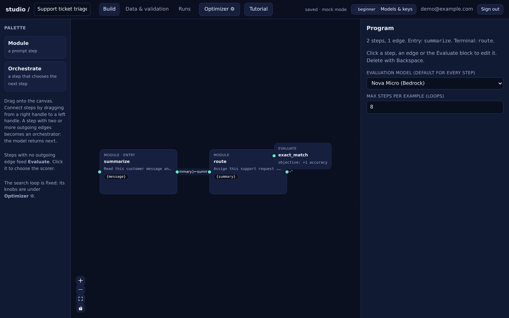
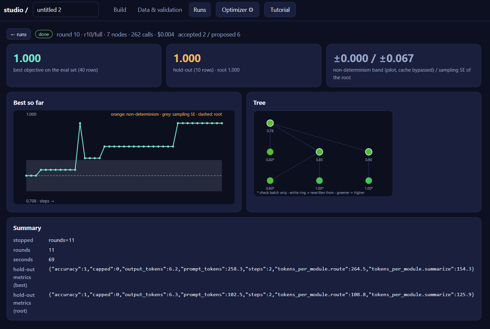

# prompt_optimization

Three sites, one repository, all built on [bpto](https://github.com/sign-of-fourier/bpto) (Bayesian Prompt Tree
Optimization), which is consumed as a pinned git dependency.

| host | directory | what it is |
|---|---|---|
| [quantecarlo.com](https://quantecarlo.com) | `quantecarlo/` | the optimizer and the company: prompt learning, GEPA vs. Bayesian optimization, findings, About |
| [promptcompression.ai](https://promptcompression.ai) | `compression/` | content marketing for prompt compression: how it works, the business case, a worked example |
| [impromptune.com](https://impromptune.com) | `studio/` | **Impromptune**, the studio: draw a program of prompt steps, attach labelled data, optimize, deploy |

The marketing sites are plain HTML/CSS with no build step. The studio is a FastAPI backend (`studio/app/`) and a
React / React Flow canvas (`studio/web/`).

## Impromptune



Each box is a prompt step with placeholders filled from your dataset's columns or the previous step's output fields;
a step with several outgoing edges becomes an orchestrator that picks the next step. The terminal step feeds
**Evaluate**, which scores it against the labels. The optimizer (GEPA, or Bayesian optimization over the prompt tree)
rewrites steps, keeps a rewrite only when it beats its parent on the same rows, and reports the best prompt on a
hold-out set. Every run carries its own completion cache, checkpoint, event log and dollar budget, and a pilot
measures the baseline, the model's noise and the projected cost before anything is spent.



The tutorial run above (support-ticket triage on the 50-row sample, Nova Micro evaluating, Nova Lite reflecting):
the root prompt scored 0.708 on the 40-row eval set, the accepted rewrites reach 1.000, and the whole search cost
262 model calls and $0.004. The grey band is the root's sampling error; the orange band (here zero) is the
non-determinism measured by the pilot with the cache bypassed.

See [`studio/README.md`](studio/README.md) for the layout, the invariants carried over from bpto, and the tutorial.

## Run locally

```bash
# studio (offline: every test uses bpto's MockClient)
cd studio && pip install -e .[dev] && python -m pytest -q
(cd web && npm install && npm run build)                                  # dev build, served under /studio/
STUDIO_MOCK=1 STUDIO_INSECURE_COOKIE=1 uvicorn app.main:app --port 8100    # http://localhost:8100/studio/

# marketing sites: edit the HTML, then regenerate each site's llms-full.txt and sitemap
python gen-site.py all
```

`STUDIO_MOCK=1` routes every model call to a schema-generic mock — no keys, no spend. Live runs read provider keys
from `.env` (gitignored).

## Deploy

nginx serves each marketing site from its directory and the studio from `studio/web/dist` (built with
`VITE_STUDIO_BASE=/`), proxying `/api/` to uvicorn on `127.0.0.1:8100`. See `deploy/nginx.conf`,
`deploy/snippets-marketing.conf` and `deploy/studio.service`. The studio's code, sqlite database and keys live
outside every web root. The studio's name is configuration (`STUDIO_NAME` / `VITE_STUDIO_NAME`), not code.

## bpto

bpto is pinned by commit in `studio/pyproject.toml`. This repo depends only on bpto's public API and quotes only its
committed `experiments/*/NOTES.md`; anything the studio needs that bpto lacks goes upstream first, then the pin is
bumped.
